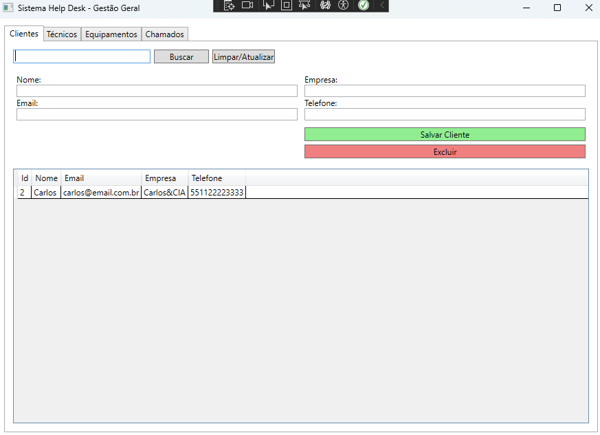

# FullstackTestCS2

Checkpoint de C#



## Pacotes utilizados

- EF Core(ORM)
- Migrations
- Conexão ao mysql
- Gerenciadores de Secrets

```bash
dotnet add package Microsoft.EntityFrameworkCore --version 8.0.0
dotnet add package Microsoft.EntityFrameworkCore.Design --version 8.0.0
dotnet tool install --global dotnet-ef
dotnet add package Pomelo.EntityFrameworkCore.MySql --version 8.0.0
dotnet add package Microsoft.Extensions.Configuration --version 8.0.0
dotnet add package Microsoft.Extensions.Configuration.UserSecrets --version 8.0.0
```

## Secrets utilizados

- DbPort
- DbName
- DbUser
- DbPassword
  ```bash
  dotnet user-secrets set "DbPort" "3306"
  dotnet user-secrets set "DbName" "SeuNomeDeBanco"
  dotnet user-secrets set "DbUser" "root"
  dotnet user-secrets set "DbPassword" "SuaSenhaDeBanco"
  ```

## Criação do Banco mysql

```sql
Create Database SeuNomeDeBanco;
```

## Controle da Migration

- Criar Migração

```bash
dotnet ef migrations add MigrationVersionName
```

- Deletar Migrações não salvas

```bash
dotnet ef migrations remove
```

- Salvar Migrações

```bash
dotnet ef database update
```
